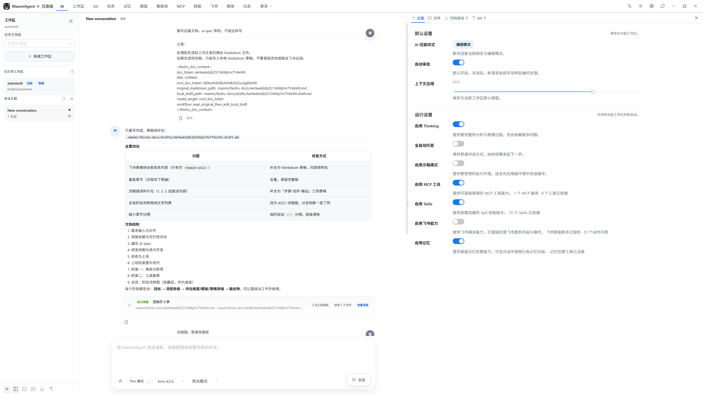
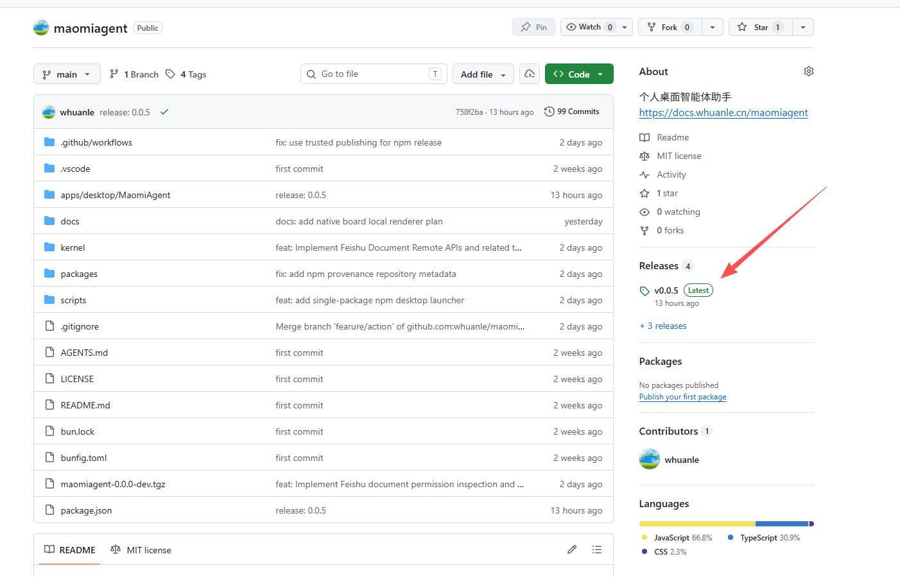

# MaomiAgent

MaomiAgent 是一个桌面端 AI 工作台，把对话、工作区、模型、智能体、技能和外部工具接到一起，方便在一个应用里处理日常问答、写作、代码、资料查询和任务协作。

- AI 对话与多会话管理  
  支持持续对话、切换模型、切换智能体，也可以结合附件和上下文继续处理同一个任务。
- 工作区协作  
  可以管理本地工作区，在处理任务时结合目录、文件和当前上下文一起工作。
- Git 辅助  
  查看代码变更、分支和提交历史，配合 AI 做阅读、分析和评审。
- 模型统一管理  
  统一配置不同模型渠道，按自己的使用场景启用、停用和切换模型。
- 智能体、技能与 MCP 扩展  
  可以按任务配置不同智能体，接入技能，并通过 MCP 连接更多外部能力和服务。
- 记忆、任务与日志  
  方便回看任务过程、保留上下文、排查问题和继续上一次工作。
- 常用业务入口  
  提供飞书、微信、AI 浏览器等入口，方便在常见工作场景里直接调用 AI 能力。





## 安装

目前已支持以下平台：

- Windows x64
- Linux x64
- macOS x64
- macOS arm64


你可以通过 Github 或者 npm 下载安装。

### GitHub Releases

可以从 GitHub Releases 下载对应平台的桌面安装包或发行包，适合直接安装使用。

下载的是压缩包，点击后可直接使用，无需安装。



### npm 安装

如果你已经有 Node.js 环境，也可以直接通过 npm 安装。


npm 包地址：[https://www.npmjs.com/package/maomiagent](https://www.npmjs.com/package/maomiagent)

```bash
npm install -g maomiagent
```


安装后启动：

```bash
maomi-agent
```


更新：

```bash
npm update -g maomiagent
```


## 开发

如果你希望从源码运行：

```bash
bun install
bun run dev
```

构建与类型检查：

```bash
bun run build
bun run typecheck
```


## 文档

安装、配置和使用教程已经整理到文档站：

https://docs.whuanle.cn
